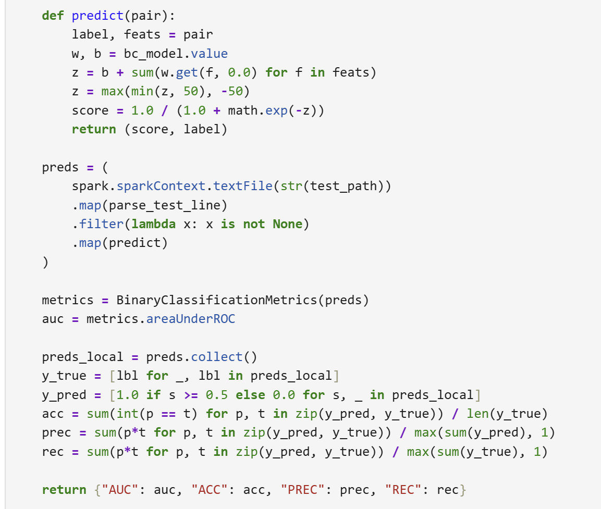

# Big Data Analytics — Assignment 03 - Recap

## Vue d'ensemble

Ce notebook implémente deux analyses appliquées en **PySpark** sur des graphes et des données de spam (chapitres 5 & 6 : Analyzing Graphs + Data Mining/ML).

**Composants implémentés** :
- **Partie A** : PageRank et Personalized PageRank (PPR) multi-source sur graphe orienté
- **Partie B** : Classification de spam avec SGD, ensembles et étude de shuffle
- **Datasets** : Graphe SNAP Gnutella p2p + Features de spam hachées


## Section 1 : Datasets acquisition

### Graphe Gnutella p2p

**Source** : SNAP (Aug 8, 2002) — P2P Gnutella network
- Fichier original : `p2p-Gnutella08.txt.gz` (compressé)
- Format source : Edge list (u v) par ligne
- Format cible : Adjacency list (u v1 v2 v3 ...)

**Conversion** :
```
p2p-Gnutella08.txt.gz 
    → parse edges
    → group by source node
    → save adjacency format
```

**Résultat** : `data/p2p-Gnutella08-adj.txt`
- Nombre de nœuds : ~6,300
- Chaque ligne : `node_id neighbor_1 neighbor_2 ...`

### Spam Features Dataset

**Source** : Precomputed hashed byte 4-gram features + labels

Fichiers :
- `spam.train.group_x.txt.bz2` - Groupe d'entraînement X
- `spam.train.group_y.txt.bz2` - Groupe d'entraînement Y  
- `spam.train.britney.txt.bz2` - Dataset Britney (shuffle study)
- `spam.test.qrels.txt.bz2` - Test set

Format ligne : `docid <spam|ham> f1 f2 f3 ...` (feature IDs)

---

## Section 2 : Partie A — PageRank et Personalized PageRank

### PageRank classique

**Objectif** : Calculer l'importance de chaque nœud dans un graphe orienté

**Formule** :
$$PR(v) = \frac{1-d}{N} + d \sum_{u \to v} \frac{PR(u)}{|out(u)|}$$

Où :
- $d = 0.85$ (damping factor)
- $N$ = nombre de nœuds
- $|out(u)|$ = nombre de voisins sortants de $u$

**Implémentation** :
1. Charger adjacency list en RDD
2. Initialiser ranks uniformément : $PR(v) = 1/N$
3. À chaque itération :
   - Mapper : émettre contribution PR(u)/|out(u)| à chaque voisin
   - Reducer : sommer les contributions
   - Ajouter teleport mass (1-d)/N
   - Gérer dead-ends : redistribuer masse manquante
4. Itérer 10 fois (convergence)
5. Trier et retourner top-20

**Résultats** :
- **Fichier** : `outputs/pagerank_top20.csv`
- **Plan** : `proof/plan_pr.txt`


### Personalized PageRank (PPR) - Multi-Source

**Objectif** : Calculer PageRank avec teleportation restreinte à un ensemble de sources S

**Formule modifiée** :
$$PPR(v | S) = \frac{1-\alpha}{|S|} \cdot \mathbb{1}_{v \in S} + \alpha \sum_{u \to v} \frac{PPR(u|S)}{|out(u)|}$$

Où :
- $\alpha$ = damping factor (par défaut 0.85)
- $S$ = ensemble de nœuds sources
- Teleportation uniforme sur S uniquement

**Implémentation** :
1. Initialiser mass 1/|S| sur sources S, 0 ailleurs
2. À chaque itération :
   - Contribuer mass aux voisins (comme PR classique)
   - Sur jumps aléatoires : teleporter uniquement vers S
   - Gérer dead-ends : redistribuer vers S
3. Paramétrable : `--sources s1,s2,... --alpha 0.85 --iterations 10`
4. Top-20 PPR scores

**Résultats** :
- **Fichier** : `outputs/ppr_top20.csv`
- **Plan** : `proof/plan_ppr.txt`


---

## Section 3 : Partie B — Spam Classification avec SGD

### Trainer - SGD sur features hachées

**Objectif** : Entraîner un classifieur binaire spam/ham avec SGD sur features hachées

**Format entrée** : `docid <spam|ham> f1 f2 f3 ...`
- `docid` : ID du document
- Label : `spam` (y=1) ou `ham` (y=0)
- Features : liste d'IDs de features hachées

**Algorithme SGD** :
1. Vecteur de poids : `w[feature_id]`
2. Pour chaque instance :
   - **Score** : $s = \sum_{f \in features} w[f]$
   - **Probabilité** : $p = \frac{1}{1 + e^{-s}}$ (sigmoid)
   - **Mise à jour** : $w[f] := w[f] + (y - p) \cdot \delta$ pour chaque $f$
3. Paramètres : `--delta` (learning rate), `--epochs` (nombre de passes)

**Pipeline RDD** :
- Charger instances d'entraînement
- Grouper par dummy key (1) → single reducer
- Itérer SGD sur l'iterator
- Sauvegarder modèle : (feature_id, weight)

**Résultats** :
- Modèles : `outputs/model_group_x/`, `outputs/model_group_y/`, `outputs/model_britney/`


### Predictor - Application du modèle

**Objectif** : Charger modèle et prédire spam/ham sur test set

**Algorithme** :
1. Charger poids : `w[feature_id]`
2. Pour chaque test instance :
   - Score : $s = \sum_{f \in features} w[f]$
   - Prédiction : `spam` si $s > 0$, sinon `ham`
3. Sortie : `(docid, score, predicted_label)`

**Résultats** :
- Prédictions : `outputs/predictions_group_x/`, `outputs/predictions_group_y/`


### Ensemble - Average & Vote

**Objective** : Combiner prédictions de plusieurs modèles

**Method 1 - Average** :
- Moyenner les scores de N modèles
- `predicted_label = spam` si moyenne > 0

**Method 2 - Vote** :
- Majority voting sur labels
- `score = #spam_votes - #ham_votes`

**Résultats** :
- Ensemble average : `outputs/predictions_ensemble_average/`
- Ensemble vote : `outputs/predictions_ensemble_vote/`


### Évaluation - Métriques

**Métriques calculées** :
- **AUC** (Area Under ROC Curve) via Spark ML evaluator
- **1-ROCA%** : Optional metric from provided C script

**Résultats** : `outputs/metrics.md`


### Shuffle Study - 10 trials

**Objectif** : Étudier l'effet du shuffle des données d'entraînement sur les performances

**Protocole** :
1. Prendre dataset Britney
2. 10 trials avec shuffle aléatoire des instances
3. Chaque trial : entraîner modèle + évaluer AUC
4. Reporter distribution des scores

**Résultats** :
- 10 modèles entraînés : `outputs/model_britney_run_1/` → `run_10/`
- Distribution statistique des AUC
- Conclusions sur stabilité/variance


---

## Section 4 : Spark UI & Performance

### Monitoring

Les exécutions sont capturées dans `lab_metrics_log.csv` avec :
- `timestamp_utc` : Horodatage UTC
- `task` : Nom de la tâche (pagerank, ppr, train_group_x, etc.)
- `files_read` : Nombre de fichiers lus
- `size_read_MB` : Taille des données
- `shuffle_read_MB` / `shuffle_write_MB` : I/O shuffle
- `execution_time_sec` : Durée

### Physical Plans

**PageRank** : `proof/plan_pr.txt`
- Adjacency list scan
- Flatmap pour contribution PR
- Reducebykey pour agrégation
- Teleport mass ajout
- Iteration loop

**PPR** : `proof/plan_ppr.txt`
- Similaire à PR
- Teleportation restreinte à S
- Multi-iteration avec mapPartitions preserving





